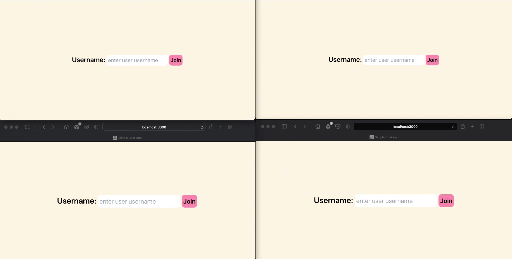

### Simple/toy WebSocket chat-app using React, Redux (via toolkit), Typescript and Rails (backend)

This is a toy project exploring the interaction and integration of WebSockets using React/Redux/Rails.

The rails backend project: [https://github.com/fmendez/chat-app-backend-rails](https://github.com/fmendez/chat-app-backend-rails)
